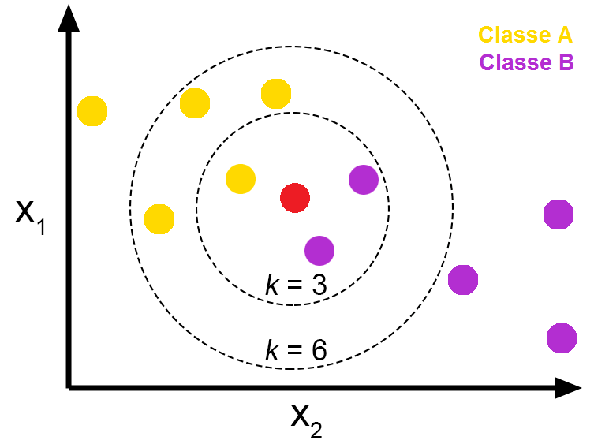
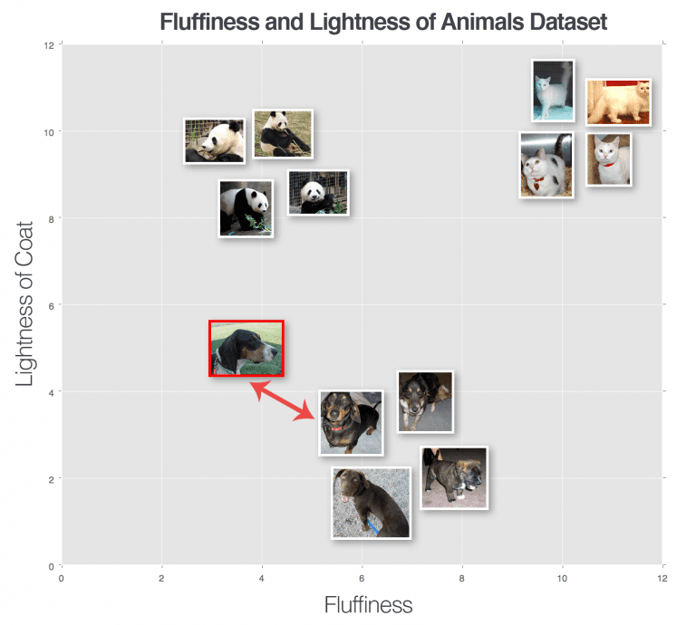
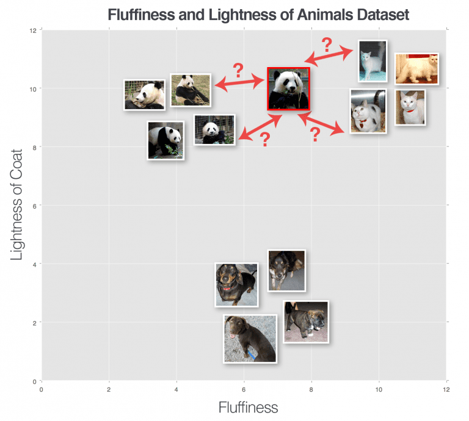

# Sobre o Projeto

Este projeto visa gerar um classificador de imagens usando o algoritmo KNN(K-Nearest Neighbors).

# Sobre o Algoritmo KNN

Dado um conjunto de dados de treino(geralmente representado como vetores) e suas respectivas classes, a fase de treinamento deste algoritmo consiste apenas em armazenar as features e classes deste conjunto.

Na fase de classificação, a classe de um elemento não classificado será definida pela classe mais recorrente dos `K` vizinhos mais próximos, sendo `K` um parâmetro definido pelo usuário. Pode-se também definir como será medida a distância entre os elementos. Alguns métricas comuns para elementos numéricos são a distância euclidiana e de Manhattan.







No caso deste projeto, as features das imagens são os valores dos seus histogramas para os canais R, G e B. O treinamento é feito usando a biblioteca [Sklearn](https://scikit-learn.org/stable/) e o processamento das imagens é feito usando [Numpy](https://numpy.org/), [Pandas](https://pandas.pydata.org/) e [OpenCv](https://opencv.org/).

# Parâmetros de Treino

Os parâmetros de treino podem ser definidos no arquivo `params.py`.

```python
folders = ['gorillas', 'orangutans']
img_size = 256
num_imgs = -1
test_size = 0.3
random_state = 42
max_k = 100

classify_imgs = ['gorilla.jpg', 'gorilla2.jpg',
                'orangutan.jpg', 'orangutan2.jpg']
```


* `folders` - Pastas contendo as imagens para treinamento
* `img_size` - Dimensão para a qual todas as imagens serão redimensionadas
* `num_imgs` - Quantidade de imagens que serão lidas por pasta. Defina -1 caso queira ler todas as imagens em cada pasta
* `test_size` - Porcentagem das imagens que serão usadas para teste do classificador(medição do score). O resto das imagens será usado para treinamento
* `random_state` - Controla o embaralhamento aplicado aos dados antes de aplicar a divisão entre treino e teste. Útil para reproduzir a mesma saída em diferentes execuções
* `max_k` - Valor máximo do parâmetro `K` quando estiver buscando o seu melhor valor
* `classify_imgs` - Vetor de imagens definidas pelo usuário para teste do modelo treinado

# Executando o Código

## Instalando Dependências

`poetry install`

## Convertendo imagens para CSV

`poetry run imgs_to_csv`

Para cada valor no parâmetro `folders`, um arquivo `.csv` será gerado no diretório raiz.

## Realizando Treinamento

`poetry run train`

O classificador será exportado para o arquivo `knn_pickle`, que será usado na etapa de predição

## Classificando imagens

`poetry run classify`
